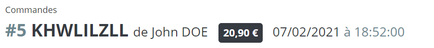

# Gestion de la page commande

## Comprendre l'organisation de la page commande

Divisée en **6 sections**, la page vous donne accès à tous les détails d'une commande.

⬆En **haut de la page**, se trouve un **résumé rapide de la commande** contenant :

* la référence de la commande 
* le nom du client 
* le montant total 
* la date et l'heure de validation

↖Dans le **coin supérieur gauche**, la section **Client** vous donne des informations sur le client et la note privée, s'il y en a. Vous pouvez même accéder au dossier personnel du client pour voir plus de détails.

↗Dans le **coin supérieur droit**, la section **Produits** vous donne accès à divers détails sur les produits commandés.

🔽Juste **en dessous de la section Produits**, il y a une **section administrative** qui contient quatre onglets qui vous donnent accès à :

* l'état et l'historique de la commande
* les documents liés à la commande \(par exemple, facture, bon de livraison, etc.\) 
* les informations relatives à l'expédition 
* les retours de marchandises

↘Dans le **coin inférieur droit**, la **section Paiement** vous donne des informations sur les détails du paiement \(date de la transaction, méthode utilisée, montant total, etc.\) Vous pouvez également enregistrer un nouveau paiement.

↙Enfin, dans le coin inférieur gauche, la section Messages vous permet d'envoyer un message au client à propos de sa commande, ou de laisser un message privé à votre équipe.

Dans cette section :





